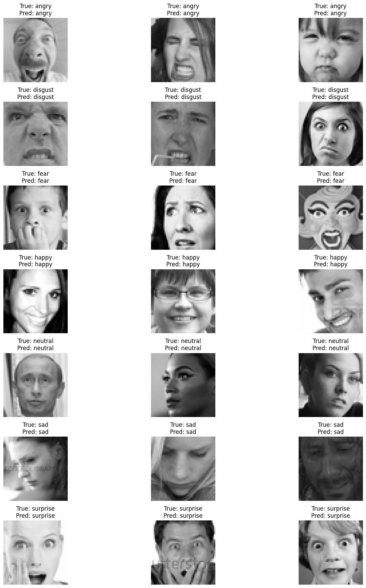

# Sentiment Analysis through Facial Expression Recognition Using Machine Learning

----------
 


## Project Overview ##

This project focuses on the development of a facial expression recognition system using Convolutional Neural Networks (CNNs), specifically leveraging the VGG16 architecture. The model is trained to detect and classify seven different facial expressions: anger, disgust, fear, happiness, sadness, surprise, and neutrality. The system is designed with real-time applications in mind, particularly in the domains of mental health monitoring, customer service, and human-computer interaction.

## Features ##

Model Architecture: VGG16 CNN, fine-tuned for facial expression recognition.
Dataset: The model was trained and evaluated on the FER-2013 dataset, which includes over 35,000 labeled images.
Transfer Learning: The model utilizes transfer learning by fine-tuning a pre-trained VGG16 model, originally trained on ImageNet, to adapt it for emotion detection.
Real-Time Detection: The system is capable of real-time facial expression recognition, making it suitable for applications in dynamic environments.
Visualization Tools: Includes scripts for visualizing model performance metrics, confusion matrix, and PCA plots.

## Installation ##

##  To clone and run this project, you'll need Git and Python installed on your machine. ##

``` bash
# Clone the repository
https://github.com/RamyasriManyala/HumanEmotionDetection.git

```

- The dataset taken was **"FER 2013"**. It can be downloaded through the link "[https://github.com/npinto/fer2013](https://www.kaggle.com/datasets/msambare/fer2013)". Image augmentation was performed on this data.


## Model  ##

The model achieved an accuracy of approximately 55% on the test dataset, with higher precision in detecting distinct emotions such as happiness and surprise. However, the model showed challenges in distinguishing between emotions like sadness and neutrality. The confusion matrix and other performance metrics are available in the visualization results.

#### The model will be able to detect 7 types of emotions:-
 #####  Angry , Sad ,  Neutral ,  Disgust ,  Surprise ,  Fear  , and   Happy

 ### For final code of Emotion Detection Code

 ### Real time emotion detection is also shown in code ###

Refer to the notebook /HumanEmotionDetection_Finalcommit.ipynb.<br/>

### Results are kept in sepearate folder can access through ###

Refer to the notebook /Results <br/>

 ## Future Work ##

### Future improvements could include: ###

- Expanding the Dataset: Incorporate more diverse facial expressions and demographics to improve model generalization.
- Advanced Architectures: Experiment with advanced architectures like Capsule Networks to improve detection of subtle emotions.
- Multimodal Emotion Recognition: Integrate additional modalities such as voice or physiological signals to create a more comprehensive emotion recognition system.
- Real-Time Deployment: Further optimize the model for deployment in real-time systems and test in dynamic environments.


### License ###

This project is licensed under the MIT License - see the LICENSE file for details.

### Acknowledgements ###

Dataset: FER-2013 Dataset
Pre-trained Model: VGG16 weights from ImageNet
